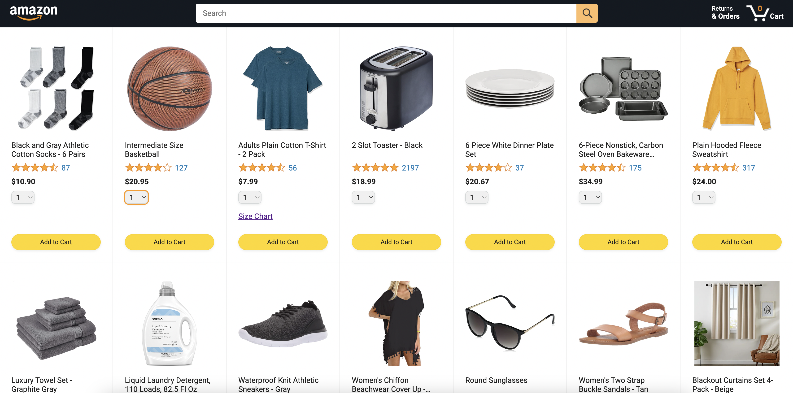
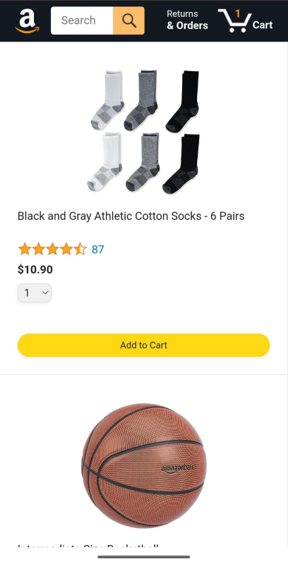

# 🛒 Amazon-Clone

Welcome to my Amazon Clone — a frontend project built to mimic the design and basic functionality of Amazon. It is a multi-page website. This was created to practice and improve my skills in HTML, CSS, and JavaScript.

## 🚀 Features

- ✅ Responsive UI

- 🖼️ Products Grid rendered using JavaScript

- 🔍 Working Search bar 

- 🧭 Navigation bar 

- 🛒 Cart icon with item counter

- 💾 Cart system with LocalStorage

## Stack Used :

- HTML5

- CSS3

- Vanilla JavaScript

## 📸 Screenshots

### On Big Screens:

### On Mobile Screens:

## 📌 What I Learned

- Structuring clean HTML layouts

- Styling responsive pages using CSS Grid,
 Flexbox and Media tags

- Adding interactivity using JavaScript

- Importance of reusable components and semantic HTML

## credits:
**[supersimpledev](https://www.youtube.com/watch?v=EerdGm-ehJQ&t=78823s&pp=ygUWamF2YXNjcmlwdCBmdWxsIGNvdXJzZQ%3D%3D)**